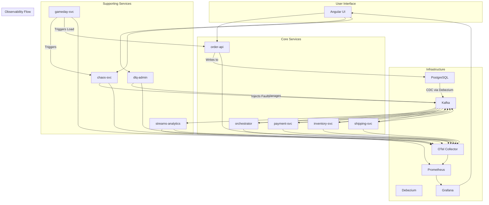

# Chaos Symphony - System Architecture

> **Author:** Dr. Porkoláb Ádám

This document provides a high-level overview of the Chaos Symphony system architecture, its components, and their interactions.

## 1. Core Philosophy

The system is designed as a set of decoupled, event-driven microservices. The primary goal is not just to perform a business function, but to do so in a resilient and observable way. Communication is asynchronous via Apache Kafka, and data consistency across services is maintained using the Saga and Outbox patterns.

## 2. Component Diagram

The following diagram shows the main components of the system and their relationships.



## 3. Order Creation Saga - Sequence Diagram

This diagram illustrates the "happy path" for the order creation saga, showing the flow of events between services.

```mermaid
sequenceDiagram
    participant User
    participant Order API
    participant Database
    participant Debezium
    participant Kafka
    participant Orchestrator
    participant Payment Svc

    User->>+Order API: POST /api/orders
    Order API->>+Database: BEGIN TX
    Order API->>Database: INSERT INTO orders
    Order API->>Database: INSERT INTO order_outbox
    Order API->>-Database: COMMIT TX
    Order API-->>-User: 202 Accepted (OrderID)

    Debezium->>+Database: Read WAL
    Debezium->>-Database:
    Debezium->>+Kafka: Produce to 'order.created'
    Debezium-->>-Kafka:

    Kafka->>+Orchestrator: Consume 'order.created'
    Orchestrator->>Orchestrator: Start Saga, update state
    Orchestrator->>+Kafka: Produce to 'payment.requested'
    Orchestrator-->>-Kafka:

    Kafka->>+Payment Svc: Consume 'payment.requested'
    Payment Svc->>Payment Svc: Process payment
    Payment Svc->>+Kafka: Produce to 'payment.successful'
    Payment Svc-->>-Kafka:

    Kafka->>+Orchestrator: Consume 'payment.successful'
    Orchestrator->>Orchestrator: Continue Saga...
```

## 4. Key Architectural Decisions (ADRs)

*   **ADR-0001: Saga Pattern for Long-Running Transactions:** We chose the Saga pattern (orchestration-based) over two-phase commits to ensure service decoupling and scalability. This avoids distributed locks but requires careful handling of compensation logic.
*   **ADR-0002: Transactional Outbox for Event Publishing:** To guarantee that events are published if and only if the business transaction commits, we use the Outbox pattern with Debezium for Change Data Capture (CDC). This prevents data loss and inconsistency between the service's database and the message broker.
*   **ADR-0003: Centralized Chaos Configuration:** Instead of embedding chaos logic in each service, a central `chaos-svc` provides a dynamic, API-driven way to manage fault injection. This allows for system-wide experiments without redeploying services.
*   **ADR-0004: BFF for UI Metrics:** The `streams-analytics` service acts as a Backend-for-Frontend for the SLO dashboard, aggregating multiple Prometheus queries into a single, efficient API call for the UI.
*   **ADR-0005: Application-Level Canary Releases:** To de-risk deployments of new versions, the system supports canary releasing at the application level. This pattern does not require a complex service mesh and is orchestrated by several collaborating components:
    *   **Traffic Splitting (`orchestrator`):** This service holds a dynamic property, `canary.payment.percentage`. For each message, it decides whether to route it to the main topic (`payment.requested`) or the canary topic (`payment.requested.canary`) based on this percentage.
    *   **Canary Consumer (`payment-svc-canary`):** A second instance of the `payment-svc` is run with a `canary` Spring profile. This profile configures the service to listen only to the `payment.requested.canary` topic with a unique consumer group ID.
    *   **Dynamic Control (`chaos-svc`):** A REST endpoint on this service allows dynamically updating the `canary.payment.percentage` property in the `orchestrator` via its Actuator endpoint. This enables turning the canary on or off and adjusting the traffic percentage at runtime without a restart.
    *   **Limitation:** This approach manages message routing at the application layer. It does not provide true HTTP-level traffic splitting for synchronous calls, which would require an API Gateway or a service mesh (like Istio or Linkerd). For this event-driven system, however, it is a powerful and sufficient pattern.
*   **ADR-0006: Persistent Saga State for Compensation:** Saga state is persisted in the orchestrator's database to enable:
    *   Recovery from service restarts during compensation
    *   Retry of stuck compensations via scheduled job
    *   Audit trail of saga lifecycle
    *   Metrics on compensation rates
*   **ADR-0007: OAuth2/JWT Authentication:** Admin APIs (DLQ management, chaos injection) are protected with OAuth2 Resource Server:
    *   **Why JWT?** Stateless authentication scales horizontally without session synchronization
    *   **Why Resource Server?** Services validate tokens locally without calling the IdP on every request
    *   **IdP Agnostic:** Supports Keycloak, Auth0, Okta, or any OIDC-compliant provider via configuration
    *   **Role Mapping:** Custom converter handles both Keycloak (`realm_access.roles`) and Auth0 (`permissions`) claim formats
    *   **Development Mode:** `spring.profiles.active=dev` disables authentication for local development
    *   **Trade-off:** Token revocation requires short expiry times or token introspection (not implemented)
*   **ADR-0008: In-Memory Fraud Velocity Tracking:** The fraud detection service tracks customer order velocity using an in-memory `ConcurrentHashMap`:
    *   **Why In-Memory?** Simplicity for demonstration purposes; no external dependency required
    *   **Trade-off:** Velocity data is lost on service restart, potentially allowing fraud patterns to go undetected
    *   **Production Recommendation:** Replace with Redis Sorted Sets for time-windowed counting with persistence, or a database-backed solution with TTL-based cleanup
    *   **Current Mitigation:** High-value orders are always flagged regardless of velocity, providing a safety net

## 5. Deployment - Kubernetes & Canary

The project is configured for deployment to a Kubernetes cluster. The necessary manifest files are located in the `/kubernetes` directory.

### Directory Structure & Deployment

The `/kubernetes` directory contains subdirectories for each service, each holding its `deployment.yaml` and `service.yaml`. A root `kustomization.yaml` file ties them all together.

To deploy the entire application stack, a user with `kubectl` access to a configured cluster can run:

```bash
kubectl apply -k kubernetes/
```

This will create all the necessary Deployments and Services in the cluster.

### Advanced Canary Releases with Istio

While the application supports a basic, message-based canary release pattern, a more robust, infrastructure-level canary can be achieved using a service mesh like Istio. The Kubernetes manifests provide the foundation for this.

Below is a conceptual guide and example configuration for implementing a canary release for the `payment-svc`.

**Prerequisites:** A running Kubernetes cluster with Istio installed and sidecar injection enabled for the target namespace.

**Step 1: Define Subsets using a `DestinationRule`**

First, create a `DestinationRule` to define the `stable` and `canary` versions of the `payment-svc`. The Kubernetes selector will target pods based on the `version` label.

```yaml
# kubernetes/payment-svc/destination-rule.yaml
apiVersion: networking.istio.io/v1alpha3
kind: DestinationRule
metadata:
  name: payment-svc
spec:
  host: payment-svc
  subsets:
  - name: stable
    labels:
      version: stable
  - name: canary
    labels:
      version: canary
```

You would need to update the `deployment.yaml` for `payment-svc` to include a `version: stable` label in its template. A separate deployment for the canary version would have `version: canary`.

**Step 2: Split Traffic with a `VirtualService`**

Next, create a `VirtualService` to manage the traffic routing. This example splits traffic, sending 90% to the stable version and 10% to the canary.

```yaml
# kubernetes/payment-svc/virtual-service.yaml
apiVersion: networking.istio.io/v1alpha3
kind: VirtualService
metadata:
  name: payment-svc
spec:
  hosts:
  - payment-svc
  http:
  - route:
    - destination:
        host: payment-svc
        subset: stable
      weight: 90
    - destination:
        host: payment-svc
        subset: canary
      weight: 10
```

By adjusting the `weight` values in this `VirtualService`, you can dynamically control the percentage of traffic routed to the canary instance, allowing for progressive rollouts and safe testing in a production environment.
