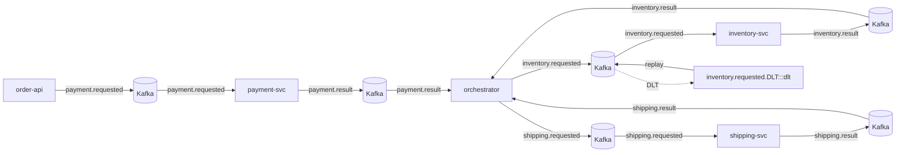

```mermaid
flowchart LR
  OA[order-api] -->|payment.requested| K1[(Kafka)]
  K1 -->|payment.requested| PS[payment-svc]
  PS -->|payment.result| K2[(Kafka)]
  K2 -->|payment.result| ORCH[orchestrator]

  ORCH -->|inventory.requested| K3[(Kafka)]
  K3 -->|inventory.requested| IS[inventory-svc]
  IS -->|inventory.result| K4[(Kafka)]
  K4 -->|inventory.result| ORCH

  ORCH -->|shipping.requested| K5[(Kafka)]
  K5 -->|shipping.requested| SS[shipping-svc]
  SS -->|shipping.result| K6[(Kafka)]
  K6 -->|shipping.result| ORCH

  classDef dlt fill:#fdd;
  K3 -.DLT.-> D1[inventory.requested.DLT:::dlt]
  D1 -->|replay| K3
	
```